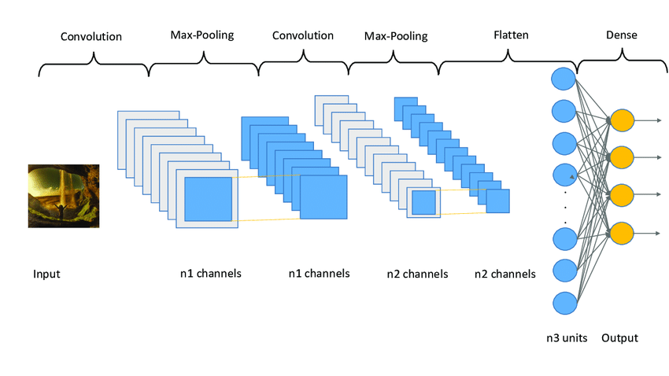

# Deep Learning Repository

This repository contains my deep learning projects from my **Post Graduate Diploma (PGD) in Data Science** at NED University. The projects involve applying deep learning techniques to different datasets, implementing Convolutional Neural Networks (CNN) for classification tasks, and experimenting with sequence processing using ConvNets.


# CNN Architecture

This is the Convolutional Neural Network architecture used in the project.




## Projects

### 1. **Cat-Dog CNN Classifier**
A Convolutional Neural Network (CNN) classifier to distinguish between images of cats and dogs. The model achieves **97% accuracy** and uses visualizations like confusion matrices and F1 scores for performance analysis. The notebook contains the full implementation of the model.

- [View Project Notebook](https://github.com/SheemaMasood381/Deep-Learning/blob/main/CNN%20-%20Images/cat-dog-cnn-classifier-97-Accuracy.ipynb)

### 2. **Sequence Processing with ConvNets (Chollet DL Book - Chapter 6)**
This project focuses on implementing sequence processing models using ConvNets, inspired by Chapter 6 of François Chollet’s **Deep Learning with Python**. The assignment involves experimenting with two datasets:

- **Netflix Dataset**: I replaced the IMDB dataset used in the original notebook and applied **Conv1D sequence processing** for multi-class classification (3 classes).
- **Jena Climate Dataset (2009-2016)**: This dataset required 2D ConvNets and a **GRU-based model** for better sequence processing. I modified the architecture and hyperparameters to improve performance.

#### Key Modifications:
- Updated the input layers to fit the dataset format.
- Changed the output layer to **softmax** for multi-class classification (Netflix data).
- Used **GRU layers** for sequence processing (Jena Climate data) instead of the original Conv1D.
- Adjusted the architecture and hyperparameters to improve results.

- [View Project Notebook](https://github.com/SheemaMasood381/Deep-Learning/blob/main/Sequence%20Processing%20with%20ConvNets.ipynb)

## CNN Images
This folder contains various visualizations related to CNN architectures, model performance (confusion matrix, etc.), and other resources related to sequence processing with ConvNets.

## Getting Started

To start working with these projects, follow these steps:

1. Clone this repository:
   ```bash
   git clone https://github.com/SheemaMasood381/Deep-Learning.git

## Dependencies

- Python 3.x
- TensorFlow/Keras
- NumPy
- Pandas
- Matplotlib
- Scikit-learn

## Author

**Sheema Masood**  
[GitHub Profile](https://github.com/SheemaMasood381)

Feel free to explore, contribute, and provide feedback on the projects in this repository!

